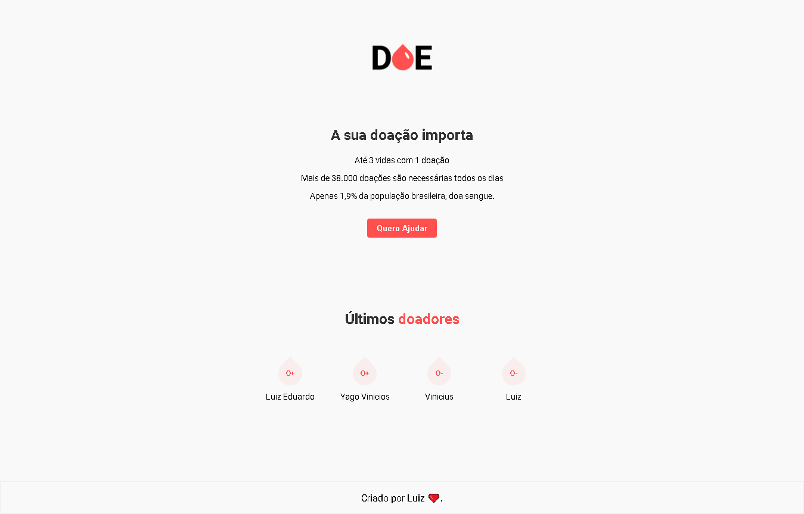

<h1 align="center">
    
</h1>

<h4 align="center">
  ☕ Code and coffee
</h4>

  

  
  

  <a href="#rocket-tecnologias">Tecnologias</a>&nbsp;&nbsp;&nbsp;|&nbsp;&nbsp;&nbsp;
  <a href="#-projeto">Projeto</a>&nbsp;&nbsp;&nbsp;|&nbsp;&nbsp;&nbsp;

 

  

## :rocket: Tecnologias

Esse projeto foi desenvolvido com as seguintes tecnologias:

- [Node.js](https://nodejs.org/en/)

## 💻 Projeto

O doe é um projeto que visa atingir um grande publico para conscientização da doação de sangue.

